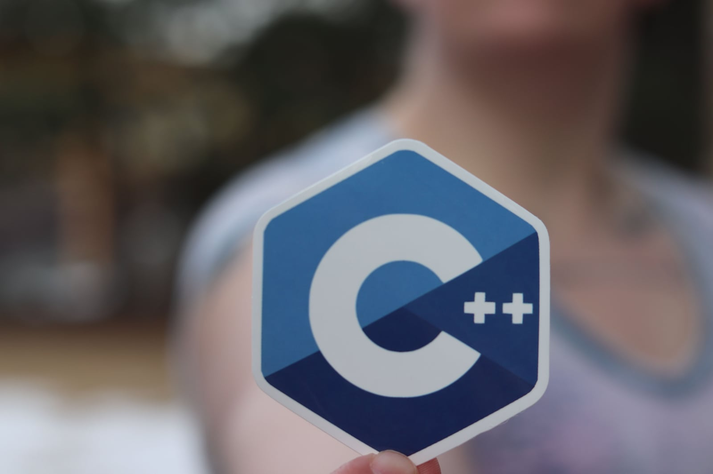
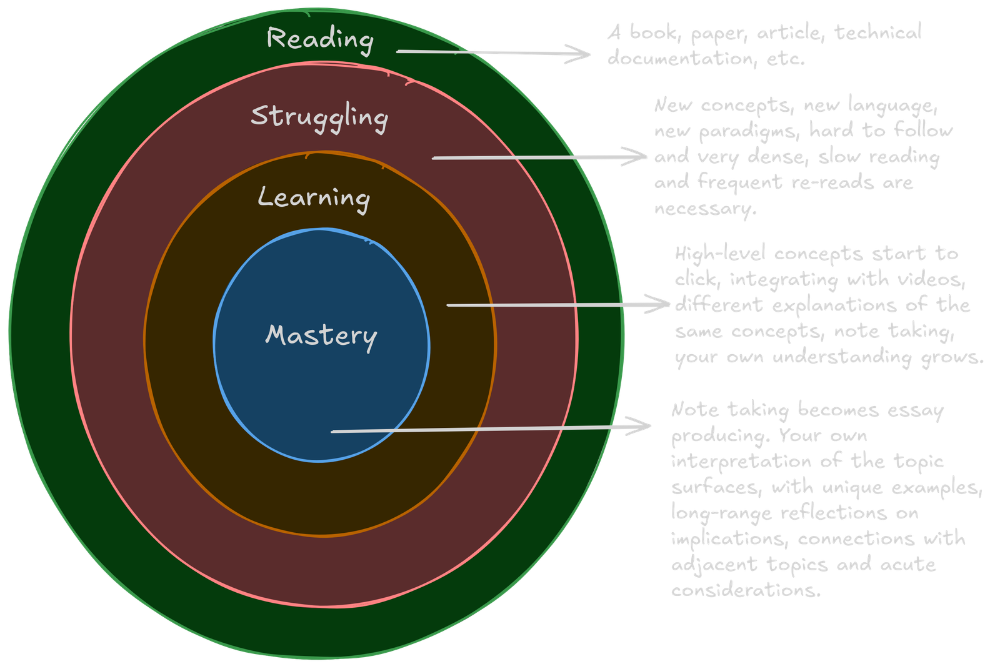

## Let's learn the C language!

Photo by [RealToughCandy.com](https://www.pexels.com/photo/woman-hand-holding-logotype-11035472/)

I am so excited about this! I love C, it's a great language that tends to expose so many of our weaknesses as programmers.
C does very little for you, so the lift is all yours. This is at time the best and worst feature of the language.

C is often defined as "close to the metal" language, but I take some issues with that. As we will discover while reading "The C Programming Language" by Brian W. Kernighan and Dennis M. Ritchie, C is actually a high-level language and was considered back then as we consider JavaScript today.
To further prove my point, I can name many languages more "close to the metal" than C, and just starting in alphabetic order, let's name one, Assembly.

Now that I got this out of the way (and my guts), let's talk about this course and get another thing out of the way: I am no C world expert, far from that. I think I know the language pretty well, but I have no delusions in that I probably have so much to learn yet, compared to people that built real-world applications in C; think about the [Linux kernel](https://en.wikipedia.org/wiki/Linux_kernel), [Redis](https://en.wikipedia.org/wiki/Redis), [FFmpeg](https://en.wikipedia.org/wiki/FFmpeg), etc.

So, knowing my own limit, this series will be a "following this or that book" series, in which every topic is guided by the hands of those that shaped the history of this rich language. I feel like this is a much better approach than me winging my way through what I think we should learn. And yes, let's start saying we right away, as in teaching, I will also be learning as much as you do.

## Sources

I have several books in C, but the ones I think are the most sound are of course the aforementioned [K&R](https://en.wikipedia.org/wiki/The_C_Programming_Language), and [C Programming - a modern Approach](https://www.amazon.co.uk/C-Programming-KN-King/dp/0393979504) by K. N. King. I am also part of a great community of learners over at [Esadecimale](https://esadecimale.it/) and here is the dedicated [Youtube channel](https://www.youtube.com/@esadecimale). Of course, there are more and more resources, and more and more youtuber or influencer you could follow, but heed my warning on this topic: try to stop watching, and prioritize reading! Yes, reading and watching are [very different skills](https://oxfordlearning.com/screen-vs-paper-which-one-boosts-reading-comprehension/), and follow significantly different pathways in your brain.

## Stop watching, start learning

More on in favour of reading: I firmly believe, that the newer generations and the old ones alike are losing the ability to read difficult text. Technical text, documentation, scientific publications. In other word, that type of dense material you used to read when you were in school, especially if you have been to any university, or you have programmed before the AI era.
Why is that a problem? Because it's affecting your ability of thinking critically, autonomously and creatively, and it's having a real material effect on your brain. It's effectively deleting those neural pathways you formed through the cycle of: reading difficult books -> struggling [re-reading, repeating, taking notes] -> memorizing -> mastering the material [can repeat in your own words and be correct about it].

The process I have just described was so painfully obvious to us, before the AI era, as the only one way to learn anything, really. Of course, the integration of videos, and other _media_ is useful, but it cannot be the one thing you do to learn. It must an accessory, an aid, a way to diversify your learning investment, not your only option.

It is also very very obvious, all considered, how one method is passive (watching only) and the other one I have described is very active instead. It is for this reason one method works incredibly well and reliably while the other only leaves you with a superficial understanding and a short-term memory at best. I will write more about this topic in the future.

## What to expect

I will try to cover the language as a whole. I will use the books to guide me and make sure to let you know if I skip something, and why. Every now and then, I will avail of some online resources to build programs to solidify the concepts, and get us going in the right directions when it comes to memorizing the syntax and building some muscle memory.

## What about AI?

I will not use AI to write code. I will not use AI to write these blog posts. I will not use AI to read documentation for me. I will not use AI in any capacity if not as a powerful search engine, as another pair of eyes on the code I publish for you to copy or check, and as a brainstorming tool for ideas on programs to build. I feel like this is the way to wisely take advantage of this amazing technology without losing our ability to actually be able to program without, if that day ever comes.

## Conclusion

That's it, for this introductory lesson, check for lesson 1 in the series to get you started, and see you there!
